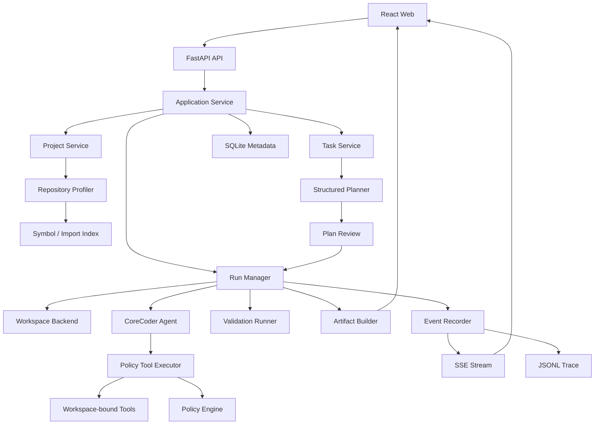
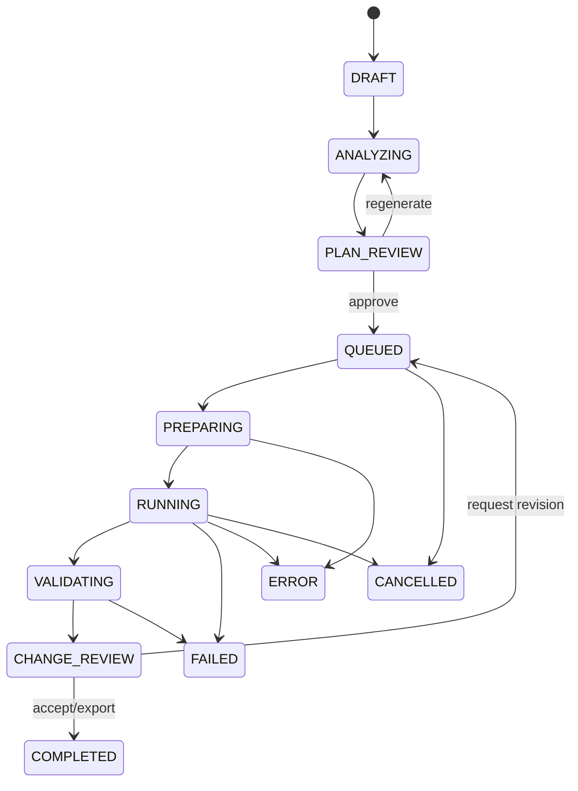

# FeaturePilot 项目详细规划

> 文档状态：方案草案 v1  
> 规划日期：2026-08-04  
> 项目基座：CoreCoder  
> 产品形态：本地优先的 Web Coding Agent 工作台  
> 核心场景：在现有代码仓库中理解需求、制定计划、实现功能、执行验证并交付可审查变更  

---

## 开始阅读这里：执行顺序清单

详细规划内容较多，实际开发不要从第一章一路通读。请先打开这份按依赖关系整理的短版清单：

[FeaturePilot_执行顺序清单.md](<D:\Vs-program\CoreCoder\FeaturePilot_执行顺序清单.md>)

你当前只需要做三件事：

1. 跑现有 CoreCoder 测试并记录结果；
2. 准备 benchmarks/cli_data_tool 示例仓库；
3. 写出第一个 export --format json 功能任务及验收条件。

完成这三件后，再创建 featurepilot/ 包。

## 1. 项目概述

### 1.1 项目名称

暂定名称：

```text
FeaturePilot
```

英文副标题：

```text
A repo-aware coding agent workspace for planning, implementing, and reviewing software changes.
```

中文定位：

```text
FeaturePilot 是一个面向现有代码仓库功能迭代的 Web Coding Agent 工作台。
用户提交功能需求、Bug 修改或小型重构任务后，系统会理解仓库结构、定位相关代码、
生成可审查的实施计划，在独立工作区完成代码修改和验证，并通过 Web 页面展示过程与结果。
```

### 1.2 一句话介绍

面试和 README 首屏统一使用：

> 基于 CoreCoder 构建面向现有仓库功能迭代的 Web Coding Agent，支持仓库理解、结构化实施计划、受控工具执行、多文件代码修改、自动验证和 Diff 审查。

### 1.3 项目不是做什么

FeaturePilot 不是：

- 一个只会回答代码问题的聊天机器人；
- 一个只能修 pytest 的测试工具；
- 一个追求取代 Claude Code 或 Cursor 的通用 IDE；
- 一个包含账号、计费、云调度和多人权限的企业 SaaS；
- 一个让模型无约束修改宿主电脑的全自动脚本。

它要做的是一条完整、可解释、可演示的软件变更交付链：

```text
选择仓库
→ 提交需求与验收条件
→ 理解仓库和影响范围
→ 生成实施计划
→ 人工确认
→ Agent 执行代码修改
→ 运行验证
→ 审查 Diff、风险与结果
→ 导出补丁或应用变更
```

---

## 2. 为什么选择这个方向

### 2.1 产品大小合适

项目比“自动修一个 Issue”更完整，因为它支持多类软件变更任务：

- 新增后端接口；
- 新增 CLI 参数或输出格式；
- 修改业务逻辑；
- 修复代码缺陷；
- 修改配置能力；
- 小型跨文件重构；
- 更新相关文档和示例。

项目又没有扩大成完整 AI 研发平台：

- 第一版单用户、本地运行；
- 一次专注一个仓库任务；
- 不做团队协作、云容器和真实 GitHub PR 自动化；
- Web 只服务于任务创建、运行观察和变更审查。

### 2.2 能体现 Coding Agent 的核心能力

一个可信的 Coding Agent 不只要“生成代码”，还要处理：

- 如何从需求找到相关文件；
- 如何避免把整个仓库都塞进上下文；
- 如何生成可执行而非空泛的计划；
- 如何在多轮工具调用中保持任务状态；
- 如何约束文件修改和命令执行；
- 如何确认改动符合验收条件；
- 如何把 Agent 的黑盒过程呈现给开发者审查。

这些问题正好能够在 CoreCoder 的最小 Agent loop 上逐层实现。

### 2.3 与优秀产品的借鉴关系

- Aider：借鉴 Repo Map、Diff、Git 变更和 lint/test 闭环，但不复制完整编辑器体验。  
  <https://github.com/Aider-AI/aider>
- SWE-agent：借鉴任务配置、trajectory、patch 和可复现实验产物。  
  <https://github.com/SWE-agent/SWE-agent>
- OpenHands：借鉴 Agent、Workspace、Runtime 和 Web 客户端的分层。  
  <https://github.com/OpenHands/software-agent-sdk>
- Cursor Background Agents：借鉴后台任务、运行列表和完成后人工接管审查的产品体验。  
  <https://docs.cursor.com/background-agent>
- GitHub Copilot Coding Agent：借鉴“任务委派—后台执行—自检—交付变更”的流程。  
  <https://github.blog/ai-and-ml/github-copilot/whats-new-with-github-copilot-coding-agent/>
- Codex：借鉴 sandbox 与 approval policy 分离、低风险行为自动执行、高风险行为需要确认的原则。  
  <https://openai.com/index/running-codex-safely/>

FeaturePilot 的目标不是复刻这些项目，而是选出对秋招项目最有价值的核心机制，组合成一个规模适中且能完整讲清楚的系统。

---

## 3. 目标用户与典型任务

### 3.1 目标用户

- 需要在陌生或半熟悉仓库中完成小型功能的开发者；
- 想使用 Coding Agent，但希望先确认计划和影响范围的开发者；
- 希望看到 Agent 做了什么、为什么改、是否验证通过的开发者；
- 学习 Coding Agent 内部机制的 AI 应用开发者。

### 3.2 第一阶段支持的任务类型

| 类型 | 示例 | 主要能力 |
|---|---|---|
| Feature | 为 CLI 增加 `--format json` | 需求理解、跨文件实现 |
| API Change | 为 FastAPI 增加订单筛选参数 | Schema、Service、Router 协同修改 |
| Bug Fix | 修复空值导致的业务异常 | 根因定位、最小补丁 |
| Configuration | 增加环境变量配置项 | 配置读取、默认值、文档同步 |
| Refactor | 统一重复的错误转换逻辑 | 影响分析、多文件修改 |
| Documentation | 为新增能力更新 README 和示例 | 代码与文档一致性 |

测试命令是所有任务的验证手段之一，但测试不是项目主题。

### 3.3 第一阶段语言范围

- 官方验证范围：Python 项目；
- 优先适配：普通 Python 包、CLI、FastAPI；
- 文件搜索和编辑能力可用于其他文本项目，但不在第一版宣传为完整支持；
- 第二阶段再考虑 React/TypeScript 项目的浏览器预览闭环。

这种限定保证项目有明确质量边界，同时不会让产品叙事局限于单一任务。

---

## 4. 完整用户故事

### 4.1 示例需求

用户选择一个已有 Python CLI 仓库，提交：

```text
给 export 命令增加 --format 参数，支持 text 和 json。
默认保持 text，JSON 输出需要包含 items 和 count，README 中补充使用示例。
```

验收条件：

```text
1. 原来的 export 命令行为不变。
2. --format json 返回合法 JSON。
3. 非法格式给出清晰错误。
4. 现有检查命令通过。
5. README 包含新参数示例。
```

### 4.2 FeaturePilot 的处理过程

#### 阶段 A：仓库分析

系统建立轻量 Repository Profile：

- 项目语言和框架；
- 文件树；
- Python 模块、类、函数和 import；
- CLI 入口；
- 配置、测试和文档位置；
- 项目推荐验证命令。

根据需求选出候选文件：

```text
src/app/cli.py               CLI 参数入口
src/app/exporter.py          导出逻辑
tests/test_export.py         相关行为描述
README.md                    用户文档
```

#### 阶段 B：生成计划

Agent 输出结构化计划：

```text
1. 阅读 export 命令的参数定义和调用链。
2. 将输出格式作为显式参数传入 exporter。
3. 保持 text 路径不变，新增 JSON 序列化分支。
4. 为非法格式复用现有 CLI 参数校验方式。
5. 更新 README 示例。
6. 运行项目配置的验证命令。
```

Web 页面展示计划、预计修改文件、风险和验证方式。用户可以确认或要求重新规划。

#### 阶段 C：执行

Agent 在独立工作区中：

- 读取候选代码；
- 使用 grep/符号搜索补充上下文；
- 修改实现和文档；
- 执行允许的项目命令；
- 根据错误输出继续修正；
- 记录每次工具调用和文件变更。

#### 阶段 D：验证与审查

FeaturePilot 输出：

- 最终 unified diff；
- 修改文件列表；
- 计划内 / 计划外改动；
- 验证命令及结果；
- token、成本、轮次和耗时；
- 风险提示；
- Agent 的最终实现摘要。

用户可以导出 patch，或将改动应用到原仓库。

---

## 5. 项目目标与成功标准

### 5.1 产品目标

#### G1：完成仓库级功能任务闭环

用户能从 Web 创建任务，经过分析、计划、执行、验证和审查完成一次真实多文件代码变更。

#### G2：让 Agent 理解仓库而不是盲目搜索

系统提供确定性的仓库结构和符号信息，并解释为何选择某些文件作为上下文。

#### G3：让用户保持控制权

计划执行前可以审查；计划外写入、敏感命令或扩展路径需要阻止或确认；最终变更不会自动合并。

#### G4：让每次执行可复盘

运行结束后可以查看计划、事件时间线、工具调用、Diff、验证和成本。

#### G5：让项目效果可度量

构建一组功能开发任务，对完成率、上下文效率、变更范围、成本和失败原因进行评测。

### 5.2 第一版 Definition of Done

- [ ] 可以注册和分析本地 Python 仓库；
- [ ] 可以创建 Feature、Bug Fix、Refactor 类型任务；
- [ ] 可以生成结构化实施计划和影响文件；
- [ ] 可以在独立 workspace 修改代码；
- [ ] 可以限制写入路径和 shell 命令；
- [ ] 可以执行项目配置的验证命令；
- [ ] 可以生成最终 Diff 和变更审查报告；
- [ ] 可以在 Web 中实时查看执行事件；
- [ ] 可以暂停在计划审查阶段；
- [ ] 可以查看历史任务和运行结果；
- [ ] 至少有两个样例仓库、八个功能任务；
- [ ] 有不调用真实模型的确定性集成测试；
- [ ] 有真实模型评测结果和失败分析；
- [ ] README 能让新用户完成一次最小 Demo。

### 5.3 明确的非目标

- 不自动 merge 或 push 用户代码；
- 不在第一版支持多人协作；
- 不实现 Kubernetes、Celery 和分布式执行；
- 不实现企业级强沙箱；
- 不开放任意网络访问；
- 不承诺支持所有语言和构建系统；
- 不以修复率超过商业产品为目标；
- 不通过堆大量 Agent 角色制造复杂度。

---

## 6. 核心亮点设计

### 6.1 亮点一：Repo-aware Context Engine

普通最小 Agent 主要依赖模型自己调用 glob、grep 和 read_file 探索仓库。FeaturePilot 增加一层轻量代码库理解能力。

#### Repository Profile

```json
{
  "language": "python",
  "frameworks": ["fastapi", "pytest"],
  "entrypoints": ["src/app/main.py"],
  "config_files": ["pyproject.toml"],
  "validation_commands": ["pytest -q", "ruff check ."],
  "modules": [],
  "symbols": [],
  "imports": []
}
```

#### 文件选择策略

候选文件分数可由以下因素组成：

- 文件路径与需求关键词匹配；
- 类、函数、路由等符号名匹配；
- grep 命中；
- import / 被 import 关系；
- 配置、测试、文档等文件角色；
- Agent 已阅读文件的邻接关系。

第一版不需要向量数据库。使用 `rg + Python AST + 轻量评分`，更容易解释、调试和做消融实验。

#### Web 展示

仓库分析结果不只喂给模型，还在页面展示：

```text
Relevant Files
92%  src/app/cli.py       命中 export 命令和 --format 参数定义
84%  src/app/exporter.py  包含 Exporter 和 serialize 符号
63%  README.md            包含 export 使用说明
```

这让“模型为什么看这些文件”变得可解释。

### 6.2 亮点二：结构化 Plan 与 Impact Map

计划必须符合固定 schema，而不是保存一段自由文本：

```json
{
  "summary": "Add JSON output support to export command",
  "assumptions": [],
  "steps": [
    {
      "id": "step-1",
      "description": "Extend CLI format option",
      "read_files": ["src/app/cli.py"],
      "modify_files": ["src/app/cli.py"],
      "validation": "CLI rejects unsupported values"
    }
  ],
  "expected_files": [],
  "validation_commands": [],
  "risks": [],
  "open_questions": []
}
```

计划的作用：

- 让用户知道 Agent 要做什么；
- 给执行阶段提供稳定目标；
- 将预计文件与最终文件进行对比；
- 支持计划审查、重新生成和后续恢复；
- 为 Eval 提供 plan accuracy 指标。

### 6.3 亮点三：独立 Workspace 与可审查 Patch

任务执行不直接修改用户仓库。

设计 `WorkspaceBackend`：

```text
CopyWorkspaceBackend     第一阶段，Windows 友好
GitWorktreeBackend      第二阶段，适合干净 Git 仓库
DockerWorkspaceBackend  后续 Roadmap
```

第一阶段流程：

```text
原仓库只读快照
→ 复制到任务 workspace
→ Agent 在副本中修改
→ 生成 patch 和文件 manifest
→ 用户确认后再应用
```

风险说明：复制目录和路径限制不等于操作系统级安全沙箱。项目文档必须明确安全边界。

### 6.4 亮点四：Policy-aware Tool Runtime

给工具声明副作用：

```text
READ       read_file / grep / glob / repo_symbols
WRITE      edit_file / write_file
EXECUTE    bash / validation
NETWORK    fetch_url
DELEGATE   sub-agent
```

工具调用经过统一执行链：

```text
参数校验
→ workspace 路径解析
→ policy decision
→ 调度和执行
→ 结果截断与脱敏
→ 事件记录
→ 返回 Agent
```

默认策略：

- workspace 内读操作自动允许；
- 计划内写操作自动允许；
- 计划外写操作记录风险或进入审批；
- 配置的验证命令允许执行；
- 包安装、网络、删除和危险 Git 操作默认拒绝；
- 只读工具可并发，写工具串行；
- 所有拒绝都作为事件返回 Agent 和 Web。

### 6.5 亮点五：Web Human-in-the-loop

人不是只在最终看答案，而是在关键节点介入：

```text
计划生成 → 人工确认
发现计划外文件 → 申请扩展范围
需要额外命令 → 请求批准
任务完成 → 人工审查 Diff
```

第一版至少实现“计划确认”和“最终 Diff 审查”。计划外路径动态审批作为第二阶段增强。

### 6.6 亮点六：可复现运行与 Eval

每次运行保存：

```text
任务输入
仓库版本 / 文件指纹
模型和参数
Context Engine 选择结果
结构化计划
事件轨迹
工具调用
最终 Diff
验证结果
token / cost / duration
```

项目最终用数据回答：

- Context Engine 是否减少了无关文件读取？
- 结构化计划是否降低计划外修改？
- 验证闭环是否能发现错误实现？
- 不同模型的完成率和成本有什么差异？

---

## 7. 总体架构



### 7.1 分层原则

- `corecoder`：保留最小 Agent 引擎，可以单独运行；
- `featurepilot`：项目、任务、计划、执行、验证和审查；
- `featurepilot.web`：API 和实时事件；
- `web`：React 客户端；
- `benchmarks`：功能任务与评测；
- `runs`：运行产物。

CoreCoder 不依赖 FastAPI、SQLite 或 React。FeaturePilot 通过组合而非复制来复用 Agent。

---

## 8. 核心领域模型

### 8.1 Project

```text
id
name
root_path
language
frameworks
default_branch
validation_commands
created_at
profile_version
```

### 8.2 Task

```text
id
project_id
type                feature / bugfix / refactor / docs
title
description
acceptance_criteria
constraints
status
created_at
```

### 8.3 Plan

```text
id
task_id
version
summary
steps
expected_files
validation_commands
risks
open_questions
status              draft / approved / rejected / superseded
```

### 8.4 Run

```text
id
task_id
plan_id
model
status
workspace_path
started_at
finished_at
rounds
tool_calls
tokens
cost
duration
exit_reason
```

### 8.5 Artifact

```text
id
run_id
type                diff / log / report / metrics / manifest
path
content_type
created_at
```

---

## 9. 任务状态机



关键区别：

- `FAILED`：Agent 正常完成，但验收未通过；
- `ERROR`：系统、模型或工具发生异常；
- `CANCELLED`：用户主动停止；
- `CHANGE_REVIEW`：代码已经生成，但仍未应用到用户仓库。

---

## 10. 关键模块设计

### 10.1 Repository Profiler

职责：

- 枚举文件并应用 ignore 规则；
- 识别 Python / FastAPI / CLI 项目；
- 读取 pyproject.toml 等配置；
- 使用 Python AST 提取模块、类、函数、import 和装饰器；
- 识别入口、API 路由、配置、测试和文档；
- 生成 profile 缓存；
- 文件变化后增量刷新相关索引。

第一版不需要构建复杂图数据库，可使用 SQLite / JSON 存储结构化索引。

### 10.2 Context Selector

输入：

```text
任务描述 + 验收条件 + Repository Profile
```

输出：

```text
候选文件 + 相关符号 + 分数 + 选择理由
```

Context Selector 不直接决定最终答案，只帮助 Planner 和 Agent 更快进入正确范围。

### 10.3 Structured Planner

职责：

- 将自然语言任务和候选上下文转成 Plan schema；
- 使用 Pydantic 校验模型输出；
- JSON 不合法时进行有限次数修复；
- 检查计划引用文件是否存在；
- 检查验证命令是否来自项目允许配置；
- 输出给 Web 审查。

### 10.4 Harness Runner

职责：

- 创建 Run；
- 准备 workspace；
- 组装计划、仓库摘要、工具和系统提示；
- 驱动 CoreCoder Agent；
- 维护轮数、工具调用、时间和预算；
- 接收取消信号；
- 进入验证阶段；
- 生成 Artifact 和最终状态。

### 10.5 Policy Tool Executor

职责：

- 统一执行所有工具；
- 校验参数；
- 限制路径；
- 判断副作用；
- 执行策略；
- 调度并发；
- 记录事件；
- 处理异常、超时和输出截断。

现有 CoreCoder 的工具不需要全部重写，可以通过 `ToolContext` 和 executor 绑定运行环境。

### 10.6 Validation Runner

验证命令来自项目配置，例如：

```yaml
validation:
  - name: unit
    command: ["python", "-m", "pytest", "-q"]
    timeout: 120
  - name: lint
    command: ["ruff", "check", "."]
    timeout: 60
```

设计要求：

- 使用参数列表调用，不通过任意 shell 拼接；
- 单命令超时；
- 捕获 stdout、stderr 和 exit code；
- 输出完整日志到 Artifact，Trace 只放摘要；
- 支持 required / optional；
- 某个验证失败后仍保留全部修改和事件。

### 10.7 Artifact Builder

输出：

```text
runs/<run_id>/
├── run.json
├── task.json
├── repository_profile.json
├── context_selection.json
├── plan.json
├── trace.jsonl
├── final.diff
├── validation/
│   ├── unit.log
│   └── lint.log
├── metrics.json
└── review.md
```

### 10.8 Run Manager

第一版：

- 本地进程内任务队列；
- 最大并发默认为 1；
- 后台线程执行阻塞 Agent；
- 支持排队、取消和状态查询；
- 服务重启后历史结果仍可读取；
- 中断时将 RUNNING 标记为 INTERRUPTED / ERROR。

不引入 Celery、Redis 或消息队列，保持项目可读性。

---

## 11. Web 产品设计

### 11.1 技术栈

```text
Backend   FastAPI + Pydantic + SQLite
Realtime  Server-Sent Events
Frontend  React + TypeScript + Vite
Artifacts JSON / JSONL / Diff / Log files
```

选择 SSE 的原因：运行事件主要是服务端单向推送；任务创建、计划审批和取消使用普通 HTTP 即可。

### 11.2 页面一：Projects

展示：

- 已注册本地仓库；
- 语言、框架、Git 状态；
- 最近一次索引时间；
- 默认验证命令；
- 最近任务；
- 重新分析仓库按钮。

项目详情展示轻量仓库地图：

- 顶层目录；
- 入口文件；
- 主要模块；
- API / CLI 符号；
- 项目配置和文档。

### 11.3 页面二：Task Composer

字段：

- Task Type；
- 标题；
- 需求描述；
- 验收条件；
- 不允许修改的范围；
- 模型；
- 最大轮数 / 成本；
- 是否执行验证。

支持从模板创建：

```text
Add Feature
Change API
Fix Bug
Small Refactor
Update Documentation
```

### 11.4 页面三：Plan Review

布局：

```text
左侧：需求与验收条件
中间：计划步骤
右侧：影响文件、风险、验证方式
```

操作：

- Approve & Run；
- Regenerate；
- 添加用户反馈后重新规划；
- 取消任务。

### 11.5 页面四：Live Run

展示：

- 当前阶段和运行时间；
- Agent 当前轮次；
- 已完成 / 进行中的计划步骤；
- 工具调用时间线；
- 文件变更；
- 验证结果；
- token 和成本；
- Cancel。

时间线事件使用可读卡片，而不是直接显示原始 JSON：

```text
Round 3
Read      src/app/exporter.py                28 ms
Search    serialize_json                     17 ms
Edit      src/app/exporter.py                +12 / -2
Policy    pytest -q                          allowed
Execute   pytest -q                          failed
```

### 11.6 页面五：Change Review

这是 FeaturePilot 最重要的页面。

展示：

- 文件树和 unified diff；
- Agent 实现摘要；
- 计划文件与实际文件对比；
- 验证命令结果；
- 风险标记；
- 修改行数；
- 运行成本和耗时；
- 导出 patch；
- 请求 Agent 继续修改；
- 应用到原仓库（后期实现，默认要求确认）。

### 11.7 页面六：Run History / Insights

展示：

- 成功、失败和取消任务；
- 按项目和任务类型筛选；
- 平均耗时、成本和轮数；
- 常见失败原因；
- 单次运行 Trace 回放。

这个页面先做列表和指标卡，不需要做复杂 BI。

---

## 12. API 草案

### Project

```text
POST   /api/projects
GET    /api/projects
GET    /api/projects/{project_id}
POST   /api/projects/{project_id}/analyze
GET    /api/projects/{project_id}/profile
```

### Task / Plan

```text
POST   /api/projects/{project_id}/tasks
GET    /api/tasks/{task_id}
POST   /api/tasks/{task_id}/plan
GET    /api/tasks/{task_id}/plans/latest
POST   /api/plans/{plan_id}/approve
POST   /api/plans/{plan_id}/regenerate
```

### Run

```text
POST   /api/tasks/{task_id}/runs
GET    /api/runs
GET    /api/runs/{run_id}
GET    /api/runs/{run_id}/events
POST   /api/runs/{run_id}/cancel
GET    /api/runs/{run_id}/diff
GET    /api/runs/{run_id}/artifacts
GET    /api/runs/{run_id}/review
```

安全约束：

- Web 不接受任意绝对路径直接进入工具；
- Project root 注册时由后端规范化和确认；
- API Key 只读取服务端环境变量；
- API 响应不包含密钥和完整环境变量；
- Artifact 下载限制在对应 Run 目录；
- 第一版仅监听 localhost。

---

## 13. 存储设计

### SQLite 存储

- projects；
- tasks；
- plans；
- runs；
- artifacts 元数据。

### 文件系统存储

- repository profile 大对象；
- trace.jsonl；
- diff；
- validation logs；
- workspace；
- review report。

选择这种组合的原因：

- SQLite 适合页面查询和状态管理；
- 日志和 Diff 用文件保存更直观；
- 不需要引入 PostgreSQL；
- 运行目录可以独立打包、复现和分享。

---

## 14. CoreCoder 改造策略

目标是“可插拔增强”，不是把原始 CoreCoder 完全改造成 Web 框架。

### 14.1 Agent 事件入口

增加可选 EventSink：

```python
Agent(..., event_sink=None, tool_executor=None)
```

默认不传时保持现有 CLI 行为。

### 14.2 Tool Context

为工具提供：

```text
workspace_root
project_root
run_id
policy
cancellation_token
event_sink
```

### 14.3 Tool Executor 注入

Agent 不再固定直接调用 `tool.execute()`；未注入 executor 时保持旧逻辑，FeaturePilot 注入受控执行器。

### 14.4 取消与预算

Agent 每轮模型调用前后、工具执行前检查：

- cancellation；
- max_rounds；
- max_tool_calls；
- wall time；
- cost budget。

### 14.5 原项目兼容性

- CoreCoder CLI 继续可用；
- 原测试必须持续通过；
- 新能力优先放到 `featurepilot/`；
- 修改 corecoder 只增加通用扩展点；
- README 保留对原项目和作者的 Attribution。

---

## 15. Benchmark 与评测设计

### 15.1 样例仓库

准备两个小而真实的仓库：

#### Repo A：Python CLI 数据工具

包含：

- Click / argparse CLI；
- 数据读取、过滤和导出；
- 配置文件；
- README；
- 基础测试。

任务示例：

1. 为 export 增加 JSON 格式；
2. 为 filter 增加日期范围；
3. 增加环境变量默认输出目录；
4. 将重复错误处理提取为公共函数。

#### Repo B：FastAPI 订单服务

包含：

- Router、Schema、Service 和 Repository 分层；
- 内存数据库或 SQLite；
- OpenAPI；
- README；
- 基础测试。

任务示例：

1. 订单列表增加 status 筛选；
2. 创建订单增加备注字段；
3. 增加取消订单接口；
4. 为分页响应增加 total 字段。

#### 为什么使用功能任务

相比纯 Bug 数据集，功能任务能评估：

- 需求理解；
- 多文件修改；
- 现有代码风格适配；
- API / CLI 一致性；
- 文档同步；
- 验收条件满足情况。

### 15.2 每个任务的内容

```text
task.yaml
repository snapshot
acceptance criteria
allowed validation commands
hidden acceptance checks
expected relevant files
reference notes（不提供给 Agent）
```

### 15.3 指标

| 指标 | 含义 |
|---|---|
| Task Completion Rate | 隐藏验收检查通过率 |
| Validation Pass Rate | 项目验证命令通过率 |
| Relevant File Recall | Context Engine 找到关键文件比例 |
| Context Precision | Agent 阅读文件中相关文件比例 |
| Plan File Accuracy | 计划文件与实际必要文件匹配程度 |
| Scope Drift | 计划外或无关文件改动比例 |
| Patch Size | 新增 / 删除行数 |
| Human Interventions | 重新规划、审批和继续修改次数 |
| Tool Calls / Rounds | 执行效率 |
| Cost / Duration | 运行成本和耗时 |

### 15.4 对比实验

至少做三组：

```text
A. CoreCoder 原始工具探索
B. CoreCoder + Repository Profile / Context Selector
C. FeaturePilot 完整 Plan + Context + Validation
```

需要回答：

- 仓库索引是否减少不相关读取；
- 计划阶段是否降低无关改动；
- 完整验证是否提高可交付率；
- 增加这些机制带来了多少 token 和时间开销。

不提前假设结果。真实实验失败也是面试时可以讨论的工程结论。

---

## 16. 推荐目录结构

```text
CoreCoder/
├── corecoder/                         # 原始 Agent 引擎
├── featurepilot/
│   ├── __init__.py
│   ├── config.py
│   ├── application.py
│   ├── domain/
│   │   ├── project.py
│   │   ├── task.py
│   │   ├── plan.py
│   │   ├── run.py
│   │   └── event.py
│   ├── repository/
│   │   ├── profiler.py
│   │   ├── python_ast.py
│   │   ├── index.py
│   │   └── selector.py
│   ├── planning/
│   │   ├── planner.py
│   │   ├── schemas.py
│   │   └── prompts.py
│   ├── runtime/
│   │   ├── harness.py
│   │   ├── workspace.py
│   │   ├── executor.py
│   │   ├── policy.py
│   │   ├── scheduler.py
│   │   ├── budget.py
│   │   └── cancellation.py
│   ├── validation/
│   │   ├── runner.py
│   │   └── models.py
│   ├── observability/
│   │   ├── recorder.py
│   │   ├── artifacts.py
│   │   └── review.py
│   ├── persistence/
│   │   ├── database.py
│   │   └── repositories.py
│   └── web/
│       ├── api.py
│       ├── schemas.py
│       ├── dependencies.py
│       ├── run_manager.py
│       └── sse.py
├── web/
│   ├── src/
│   │   ├── api/
│   │   ├── components/
│   │   ├── pages/
│   │   ├── hooks/
│   │   └── types/
│   └── package.json
├── benchmarks/
│   ├── cli_data_tool/
│   └── fastapi_orders/
├── runs/                              # gitignored
├── examples/
│   └── sample_run/
├── tests/
│   ├── corecoder/
│   ├── featurepilot/
│   ├── integration/
│   └── web/
└── docs/
    ├── architecture.md
    ├── repository-context.md
    ├── agent-runtime.md
    ├── security-boundaries.md
    ├── evaluation.md
    ├── decisions/
    └── devlog/
```

目录按里程碑逐步创建，不要求一开始生成全部空目录。

---

## 17. 实施里程碑与任务拆解

不使用固定天数，按照可验收里程碑推进。每个里程碑完成后都应有可运行产物。

### M0：基线与项目骨架

目标：确保现有 CoreCoder 状态可验证，建立 FeaturePilot 独立包。

#### 任务

| ID | 任务 | 产物 | 规模 |
|---|---|---|---|
| M0-1 | 记录当前 Git 状态和现有测试基线 | devlog / baseline | S |
| M0-2 | 梳理 CoreCoder 扩展点 | architecture note | S |
| M0-3 | 新建 featurepilot 包和配置 | package skeleton | S |
| M0-4 | 增加 CLI `featurepilot` | CLI entry | S |
| M0-5 | 建立测试目录和 FakeLLM | testing foundation | M |

#### 验收

- 原 CoreCoder CLI 正常；
- 原测试通过；
- `featurepilot --help` 可运行；
- FakeLLM 可以生成确定性 ToolCall。

### M1：Repository Intelligence

目标：注册一个仓库并生成可解释 Repository Profile。

#### 任务

| ID | 任务 | 产物 | 规模 |
|---|---|---|---|
| M1-1 | Project 模型和注册服务 | Project CRUD | M |
| M1-2 | ignore / 文件枚举 | file inventory | S |
| M1-3 | Python AST 符号提取 | symbol index | M |
| M1-4 | import 关系解析 | import graph | M |
| M1-5 | 框架、入口、验证命令识别 | repo profile | M |
| M1-6 | Context Selector 评分 | relevant files | L |
| M1-7 | 缓存与增量刷新 | profile cache | M |

#### 验收

- 可分析两个样例仓库；
- 能列出入口、模块、主要符号和验证命令；
- 给定四条示例需求，Top-K 中包含预期关键文件；
- 每个候选文件都有可展示的选择理由。

### M2：Task 与 Structured Planning

目标：从需求和验收条件生成可审查的实施计划。

#### 任务

| ID | 任务 | 产物 | 规模 |
|---|---|---|---|
| M2-1 | Task / Acceptance Criteria 模型 | task domain | M |
| M2-2 | Plan Pydantic schema | plan schema | S |
| M2-3 | Planner prompt 和 context assembly | planner | M |
| M2-4 | JSON 修复和有限重试 | robust parsing | M |
| M2-5 | 文件和命令静态校验 | plan validator | M |
| M2-6 | 计划版本、批准、拒绝 | plan lifecycle | M |
| M2-7 | CLI Plan Review | vertical demo | S |

#### 验收

- Feature、Bug Fix、Refactor 三类任务可以生成合法 Plan；
- Plan 引用的文件真实存在；
- 非法命令不能进入 approved plan；
- 用户反馈后可生成新版本；
- 计划可以序列化、恢复和比较。

### M3：受控执行与完整变更闭环

目标：在独立 workspace 中按照 approved plan 完成代码修改和验证。

#### 任务

| ID | 任务 | 产物 | 规模 |
|---|---|---|---|
| M3-1 | WorkspaceBackend 接口 | workspace abstraction | M |
| M3-2 | CopyWorkspaceBackend | safe copy workflow | M |
| M3-3 | 路径解析与逃逸防护 | workspace path guard | L |
| M3-4 | ToolEffect 元数据 | effect model | S |
| M3-5 | Policy Engine | allow / deny decision | L |
| M3-6 | Tool Executor 注入 | controlled execution | L |
| M3-7 | 读并发 / 写串行调度 | scheduler | M |
| M3-8 | 轮数、工具、时间、成本预算 | run budget | M |
| M3-9 | Validation Runner | validation | M |
| M3-10 | Diff / Artifact / Review 报告 | review package | L |
| M3-11 | CLI 端到端运行 | vertical slice | M |

#### 验收

```text
创建 Task
→ 生成并批准 Plan
→ 复制 workspace
→ Agent 修改多个文件
→ 执行验证
→ 生成 Diff 和 Review
```

且：

- 原仓库不被直接修改；
- `..` 和绝对路径逃逸失败；
- 计划外写入被记录或阻止；
- 验证失败也能生成完整产物；
- FakeLLM 端到端测试稳定通过。

### M4：Trace、历史与可恢复运行

目标：运行过程可实时观察、异常后可复盘。

#### 任务

| ID | 任务 | 产物 | 规模 |
|---|---|---|---|
| M4-1 | Event schema | event domain | M |
| M4-2 | Agent / Tool / Validation 事件 | instrumentation | L |
| M4-3 | JSONL Recorder | durable trace | M |
| M4-4 | 输出截断与 secret 脱敏 | safe logging | M |
| M4-5 | SQLite 元数据 | persistence | M |
| M4-6 | Run Manager 和队列 | background runs | L |
| M4-7 | 协作式取消 | cancellation | M |
| M4-8 | 服务重启后的历史扫描 | recovery | M |

#### 验收

- 事件 sequence 严格递增；
- Agent 异常时已有事件仍可读取；
- 历史 Run 可查询；
- 取消后保存现有 Diff、日志和状态；
- API Key 和环境变量不会写入 Trace。

### M5：Web Backend

目标：开放稳定的项目、任务、计划、运行和 Artifact API。

#### 任务

| ID | 任务 | 产物 | 规模 |
|---|---|---|---|
| M5-1 | FastAPI app 与错误模型 | API foundation | M |
| M5-2 | Project / Task / Plan API | CRUD API | M |
| M5-3 | Run / Artifact API | run API | M |
| M5-4 | SSE 事件流 | realtime API | L |
| M5-5 | localhost 和路径安全限制 | API safety | M |
| M5-6 | FastAPI 集成测试 | API tests | M |

#### 验收

- OpenAPI 文档完整；
- 可以从 API 完成项目注册到 Run Review；
- SSE 支持断线重连并补发历史事件；
- 非法 project / run / artifact 路径无法越界访问。

### M6：Web Frontend

目标：完成可投递、可演示的开发者工作台。

#### 任务

| ID | 任务 | 产物 | 规模 |
|---|---|---|---|
| M6-1 | React / TypeScript / Vite 基础 | frontend foundation | S |
| M6-2 | Projects 与 Repository Profile | project UI | M |
| M6-3 | Task Composer | task UI | M |
| M6-4 | Plan Review | plan UI | L |
| M6-5 | Live Run Timeline | run UI | L |
| M6-6 | Diff Viewer | diff UI | L |
| M6-7 | Validation / Risk / Metrics | review UI | M |
| M6-8 | Run History | history UI | M |
| M6-9 | 空状态、错误、取消与响应式 | polish | M |

#### 验收

- 用户不进入终端也能完成主要流程；
- 刷新页面后历史信息仍存在；
- 长 Diff、长日志和失败任务可以正常展示；
- TypeScript typecheck 和 production build 通过；
- 关键流程有浏览器 E2E 验证。

### M7：Benchmark、实验与项目打磨

目标：用数据展示设计价值，形成完整面试项目。

#### 任务

| ID | 任务 | 产物 | 规模 |
|---|---|---|---|
| M7-1 | 两个样例仓库 | benchmark repos | L |
| M7-2 | 八个功能任务 | benchmark tasks | L |
| M7-3 | 隐藏验收检查 | acceptance evaluator | L |
| M7-4 | Eval Runner | batch evaluation | L |
| M7-5 | Context / Plan 消融实验 | evaluation report | L |
| M7-6 | README、架构和安全文档 | documentation | M |
| M7-7 | 示例 Run 和 Demo 视频 | portfolio assets | M |
| M7-8 | 简历 bullet 与面试问答 | interview package | S |

#### 验收

- 所有数据可追溯到 run_id；
- 不虚构成功率或成本；
- README 能在五分钟内解释项目价值；
- Demo 完整展示从需求到 Change Review；
- 失败案例有原因分析，而不是只展示最好的一次。

### M8：可选增强

按优先级选择，不要同时铺开：

1. GitWorktreeBackend；
2. DockerWorkspaceBackend；
3. MCP Client；
4. Fallback 模型与模型路由；
5. Scout / Reviewer 两种受限子 Agent；
6. TypeScript / React Repository Profiler；
7. 浏览器预览与截图反馈；
8. GitHub Issue / Draft PR 集成。

---

## 18. 测试策略

### 18.1 单元测试

- Repository Profiler AST 解析；
- ignore 规则；
- Context Selector 排序；
- Plan schema 和校验；
- 路径解析与符号链接逃逸；
- Policy allow / deny；
- Scheduler 的读并发和写串行；
- Budget；
- Validation timeout；
- Artifact / Diff；
- Event sequence 和脱敏；
- 状态机非法迁移。

### 18.2 集成测试

使用 FakeLLM / ScriptedLLM：

```text
读取指定文件
→ 编辑文件
→ 执行验证
→ 返回完成
```

验证：

- 原仓库未修改；
- workspace 产生正确变更；
- Trace 和 Artifact 完整；
- Run 状态正确；
- 失败和取消也能保存现场。

### 18.3 Web 测试

- API 使用 FastAPI TestClient；
- 前端状态 reducer 和 SSE reconnect 单元测试；
- 浏览器 E2E：注册项目、创建任务、批准计划、观察运行、查看 Diff；
- production build 验证。

### 18.4 真实模型 Smoke Test

- 开发阶段优先 FakeLLM，减少成本和随机性；
- 每个里程碑结束选 1–2 个真实任务；
- 最终评测固定模型、参数和仓库版本；
- 真实失败保留 Trace 用于调试和报告。

---

## 19. 安全边界

### 第一阶段已经提供

- 独立 workspace；
- 路径规范化与越界检查；
- 写入范围限制；
- 命令 allowlist；
- network 默认关闭；
- 超时和预算；
- 用户确认计划与最终变更；
- Trace 脱敏。

### 第一阶段没有提供

- 操作系统用户隔离；
- seccomp / Windows restricted token；
- 完整进程树和网络隔离；
- 对恶意仓库的强安全保证；
- 远程多租户安全。

README 必须写明：本地 Policy Runtime 用于防误操作和限制 Agent 行为，但不是强沙箱。若面对不可信仓库，应使用后续 Docker Backend。

---

## 20. 主要风险与控制

| 风险 | 可能后果 | 控制方式 |
|---|---|---|
| 功能过多 | 每个模块都不完整 | 以 M3 CLI 纵向闭环为第一主里程碑 |
| Web 先于核心 | 页面漂亮但 Agent 不可靠 | M3 完成后再进入 M5/M6 |
| Repo Map 做成大工程 | AST 和图谱耗时过长 | 第一版只支持 Python，使用轻量索引 |
| Agent 修改范围失控 | 无关文件被改 | plan expected files + workspace policy |
| 真实模型不稳定 | 测试无法复现 | FakeLLM 集成测试 + 固定 benchmark |
| shell 风险 | 宿主被意外修改 | 参数化验证 + allowlist + workspace cwd |
| 用户现有 Git 改动 | 发生覆盖 | 默认副本运行，最终只导出 patch |
| 成本失控 | Eval 费用过高 | 单 Run budget + 固定任务 + 分阶段真实调用 |
| 指标不好看 | 项目叙事受影响 | 展示失败分类和消融结论，不只追求成功率 |

---

## 21. 项目取舍原则

遇到进度压力时，保留：

1. 仓库分析；
2. 结构化计划；
3. workspace 变更；
4. Policy Executor；
5. Validation；
6. Diff Review；
7. Web 完整主流程；
8. 至少一组真实评测。

可以延后：

1. 动态审批；
2. Git worktree；
3. Context 增量索引；
4. Run Insights 图表；
5. 自动应用 patch；
6. 多模型对比；
7. MCP 和子 Agent；
8. 浏览器预览。

---

## 22. Demo 设计

### Demo A：CLI 功能扩展

需求：

```text
为 export 命令增加 JSON 输出，并同步更新 README。
```

展示重点：

- Context Selector 找到 CLI、Exporter 和 README；
- Plan Review；
- 多文件 Diff；
- 验证结果；
- 计划文件与实际文件一致。

### Demo B：FastAPI 业务功能

需求：

```text
订单列表接口增加 status 筛选，并保持不传参数时行为不变。
```

展示重点：

- Router / Schema / Service 影响分析；
- Agent 遵循现有分层；
- API 修改 Diff；
- 隐藏验收检查；
- Change Review 风险提示。

### Demo C：小型重构失败案例

需求：

```text
抽取重复的异常转换逻辑。
```

故意保留一次验证失败的 Run，展示：

- 失败发生在哪一步；
- Agent 如何基于错误继续修改；
- Trace 如何帮助复盘；
- 为什么最终仍需要人工 Review。

展示失败案例能够证明项目不是只包装一次成功演示。

---

## 23. README 结构

```text
1. 项目定位与 Demo GIF
2. 核心用户流程
3. 主要功能
4. 架构图
5. Repository Context Engine
6. Plan → Execute → Validate → Review
7. Web 页面
8. Quick Start
9. 配置本地仓库
10. Benchmark 与真实结果
11. 安全边界
12. 测试与开发
13. Roadmap
14. 与 CoreCoder 的关系和致谢
```

README 首屏要在 30 秒内回答：

- 这是什么；
- 输入什么；
- Agent 做什么；
- 用户最终得到什么；
- 项目与普通聊天式代码助手有什么不同。

---

## 24. 简历表述模板

真实数据完成后替换方括号：

```text
FeaturePilot｜面向现有仓库功能迭代的 Web Coding Agent 工作台

- 基于 CoreCoder 设计 Plan–Execute–Validate–Review Agent 工作流，支持将自然语言功能需求转化为
  结构化实施计划，在独立 workspace 完成多文件修改、项目验证和 Diff 交付。

- 实现轻量 Repository Context Engine，使用文件路径、Python AST 符号、import 关系和关键词检索
  对相关文件排序；在 [N] 个功能任务中将平均无关文件读取降低 [X%]。

- 设计副作用感知的 Tool Runtime，对读、写、命令和网络工具执行路径校验、权限策略、超时、预算和
  读写调度，并通过结构化事件记录模型调用、工具执行、文件修改和验证结果。

- 使用 FastAPI、SSE、React 和 TypeScript 构建 Web 控制台，支持项目分析、任务创建、计划审批、
  实时运行时间线、Diff Review、验证结果和成本指标展示。

- 构建包含 [N] 个 Feature / API Change / Refactor 任务的本地评测集，对任务完成率、Context Precision、
  Scope Drift、运行成本和失败原因进行可复现实验。
```

不能在真实评测前填写成功率和降幅。

---

## 25. 面试重点讲法

### 为什么不是直接使用 CoreCoder？

```text
CoreCoder 提供了最小 Agent loop 和工具调用能力，但一次真实功能开发还需要仓库上下文选择、
计划审查、独立工作区、执行策略、验证、Diff 交付和历史复盘。FeaturePilot 保留其可读内核，
在外层补齐了一条完整的软件变更生命周期。
```

### 为什么先做 Plan？

```text
Plan 不是为了让模型多说一段话，而是形成可校验的数据结构：预计修改哪些文件、按什么步骤、
如何验证。最终可以计算计划与实际改动的偏差，也让用户在写入代码前介入。
```

### 为什么需要 Repository Context Engine？

```text
让模型在大仓库里完全靠 grep 自主探索会消耗大量 token，也容易遗漏入口。Context Engine 用确定性的
文件结构、符号和 import 信息做初筛，并展示选择理由；Agent 仍可继续搜索，但起点更稳定。
```

### 为什么 Policy 和 Prompt 要分开？

```text
Prompt 只能影响模型决策，不能形成执行边界。Policy Executor 在工具真正执行前检查路径、命令和预算，
即使模型请求计划外操作，也可以确定性拒绝并留下事件记录。
```

### 为什么不直接修改原仓库？

```text
Agent 输出具有不确定性。独立 workspace 让失败和取消可恢复，最终以 Diff 作为交付边界，
用户审查后再应用，避免覆盖正在进行的人工改动。
```

### 项目最大的技术难点是什么？

建议根据最终实现选择真实答案：

- 仓库相关文件选择；
- 工具执行的安全边界；
- Agent 状态与事件一致性；
- Web 实时事件和历史重放；
- 随机模型输出下的可复现评测。

---

## 26. 每日开发留痕建议

每个开发工作日保存：

```text
docs/devlog/YYYY-MM-DD.md
```

模板：

```markdown
# YYYY-MM-DD

## 今日目标

## 完成内容

## 关键设计决定

## 测试证据

## 遇到的问题与根因

## 下一步

## 当前风险
```

建议的架构决策记录：

```text
ADR-001 CoreCoder 与 FeaturePilot 分层
ADR-002 Repository Context 不使用向量数据库
ADR-003 Copy Workspace 作为第一后端
ADR-004 工具副作用与 Policy Executor
ADR-005 Web 实时通信采用 SSE
ADR-006 SQLite 元数据 + 文件 Artifact
ADR-007 Eval 使用功能任务而非纯 Bug 数据集
```

---

## 27. 最终项目故事

FeaturePilot 的完整项目故事应当是：

```text
CoreCoder 已经证明 Coding Agent 的核心可以很小：模型、循环和工具。

我进一步关注 Agent 进入真实仓库后的问题：它如何找到相关代码、如何让开发者先看到计划、
如何避免污染当前工作区、如何受控地执行文件和命令工具、如何证明功能实现符合验收条件，
以及如何在 Web 中审查完整过程。

因此我构建了 FeaturePilot：一个面向现有仓库功能迭代的 Web Coding Agent 工作台。
它将自然语言需求转化为结构化计划，在独立 workspace 中执行代码修改，通过项目命令进行验证，
并交付可审查的 Diff、风险、Trace 和指标。
```

这个叙事既保留 Coding Agent 的技术深度，又有明确产品界面和可演示用户价值。
